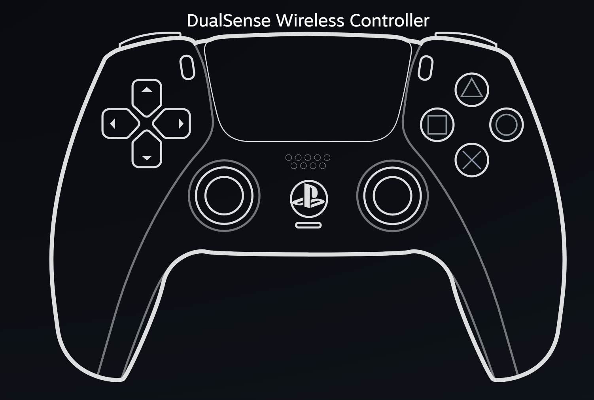

# Codex Controller for DualSense

把 PlayStation 5 DualSense 變成專為 Codex Desktop 設計的 Windows 控制器。接上 USB 後即可使用按鍵、搖桿、語音、狀態燈、震動與自適應扳機控制 Codex。



> 公開測試版 · Windows 11 x64 · USB 連線 · MIT License

## 下載與安裝

請到 [GitHub Releases](../../releases) 下載最新版本：

- `DualSense-Codex-Setup-<版本>.exe`：推薦給一般使用者。完成安裝後會在登入 Windows 時背景啟動。
- `DualSense-Codex-Portable-<版本>.zip`：免安裝版本。解壓縮後執行 `DualSenseCodex.exe`。

目前安裝程式尚未簽章，Windows SmartScreen 可能顯示「Windows 已保護您的電腦」。請先核對 Release 頁面的 SHA-256，再選擇「其他資訊」與「仍要執行」。如果不信任下載來源，請勿執行。

## 開箱即用配置

| DualSense 操作 | Codex 功能 |
| --- | --- |
| MIC | 按一下開啟／關閉 Codex 即時語音 |
| L2 | 按住使用 Codex 聽寫，放開停止 |
| R2、× | 送出或確認 |
| ○ | 取消或關閉目前選單 |
| □ | 短按刪除一字，長按清空輸入 |
| △ | 開啟 Codex 指令選單 |
| L3 | 顯示／隱藏左側欄 |
| R3、R1 | 顯示／隱藏審閱面板 |
| 左搖桿 | 鍵盤方向鍵 |
| 右搖桿上／下 | 捲動目前視窗 |
| 十字鍵 | 切換對話與最近檢視項目 |
| Touchpad 按下 | 在目前對話尋找 |
| PS | 開啟或切回 Codex |

所有按鍵都能在控制頁重新設定。個人映射儲存在 `%LOCALAPPDATA%\DS5VibeHub`，更新或移除程式時不會自動刪除。

## 控制中心

控制頁採用三層裝置中心設計：

- **手把**：直接點選 DualSense 上的按鍵，再於旁邊修改功能；完整按鍵表預設收合。
- **體驗**：集中管理 Codex 狀態燈、自適應扳機與觸控板手勢。
- **裝置**：查看連線狀態、重新偵測、測試震動與恢復推薦配置。

Codex 狀態燈預設為白色待命、藍色工作、綠色完成、黃色待核准、紅色錯誤。狀態資料只在本機處理，不包含提示詞、回覆內容或工作目錄。

## 系統需求與限制

- Windows 11 x64。
- DualSense 與可傳輸資料的 USB 線。
- Codex Desktop。
- 目前只支援 USB，不支援藍牙。
- 程式必須在背景執行，按鍵映射才能作用。
- 安裝版與可攜版均尚未進行程式碼簽章。
- 虛擬 Precision Touchpad 驅動屬於實驗性進階功能，並非主要控制流程所必需。

虛擬觸控板驅動需要 Visual Studio 2022 Build Tools、Windows 11 WDK 與 Windows 測試簽章模式。建置及安裝方式請參閱 [`driver/ds5ptp/README.md`](driver/ds5ptp/README.md)。

## 從原始碼執行

需要 Python 3.10 或更新版本。在 PowerShell 執行：

```powershell
Set-ExecutionPolicy -Scope Process Bypass
.\start-admin.ps1
```

控制頁位於 <http://127.0.0.1:4173/>。停止服務：

```powershell
.\stop.ps1
```

## 建置發布檔案

```powershell
.\packaging\build.ps1
```

建置會使用獨立環境產生可攜版 ZIP 與 Windows 安裝程式。只需要可攜版時可加上 `-SkipInstaller`。產物位於 `packaging`，並由 `.gitignore` 排除；請把它們附加到 GitHub Release，不要直接提交大型二進位檔。

## 測試

```powershell
python -m unittest discover -s . -p "test*.py" -v
python -m py_compile bridge.py approval_detection.py approval_watcher.py codex_hook.py launcher.py serve_ui.py
node --check app.js
```

目前自動測試涵蓋本機 API 權限、隱私資料清理、按鍵映射、鍵盤安全擷取、狀態燈、觸控板手勢、自適應扳機與啟動器。燈光、扳機、震動和真實手把輸入仍應在 Windows 實機驗證。

## 隱私與安全

- 控制服務只監聽本機回環位址。
- 控制頁 API 使用本機產生的隨機權杖。
- Codex 狀態事件會匿名化工作階段識別，不傳送提示詞、回覆內容或檔案路徑。
- 專案不包含 API Key、個人錄音或本機映射檔。

安全問題請依照 [`SECURITY.md`](SECURITY.md) 回報。

## 來源與授權

本專案是 LYiHub「AI Mic Series」中 DualSense 專案的修改版本。原始 MIT 版權聲明與授權條款完整保留在 [`LICENSE`](LICENSE)；本版本重新設計了 Codex Controller 介面、互動層級、按鍵工作流、背景服務與 Windows 封裝。

虛擬觸控板驅動包含或改編自 Microsoft `vhidmini2` 與 `PeronGH/BLE-PTP-PoC`。完整來源與授權請參閱 [`THIRD_PARTY_NOTICES.md`](THIRD_PARTY_NOTICES.md) 和 [`NOTICE.md`](NOTICE.md)。

DualSense、PlayStation 與相關標誌是 Sony Interactive Entertainment Inc. 或其關係企業的商標。本專案不是 Sony 或 OpenAI 的官方產品，也未獲其背書或贊助。

## 參與開發

請先閱讀 [`CONTRIBUTING.md`](CONTRIBUTING.md)。版本變更記錄位於 [`CHANGELOG.md`](CHANGELOG.md)。
